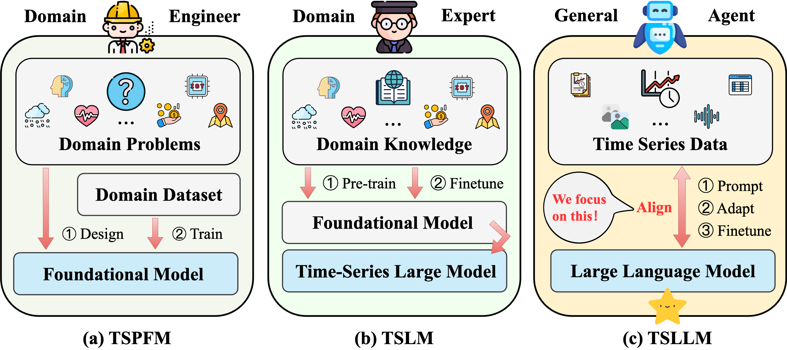
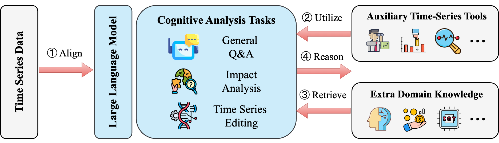
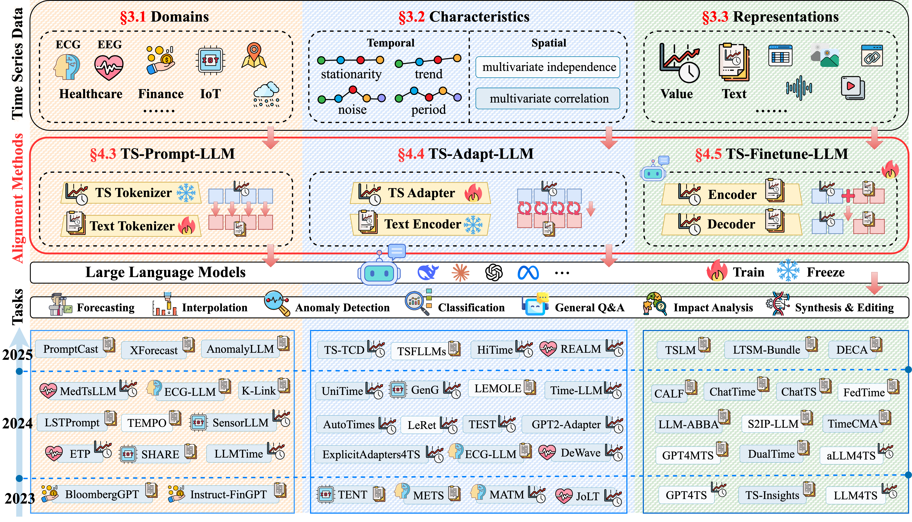
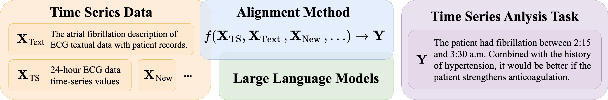
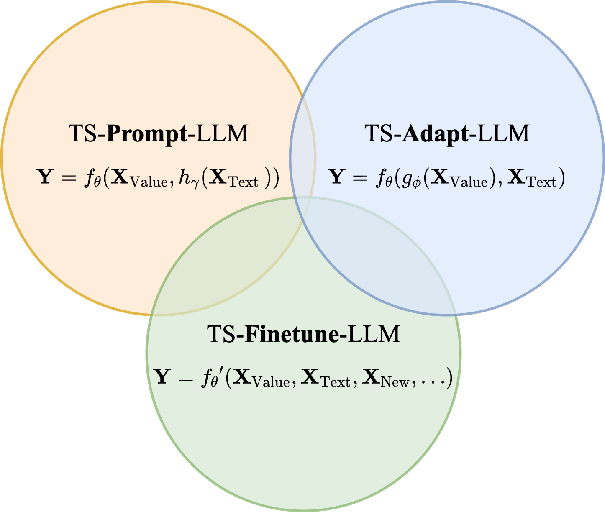
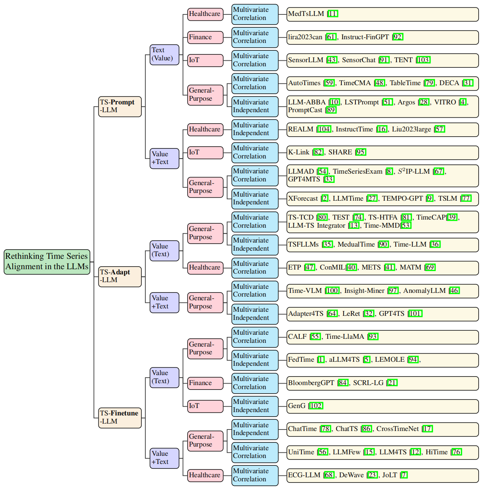

# Prioritizing Alignment Paradigms over Task-Specific Model Customization in Time-Series LLMs

<!--This repository is actively maintained by Wei Li from ***RUC WAMDM*** Group led by [*Dr. Xiaofeng Meng*](http://idke.ruc.edu.cn/). As this research topic has recently gained significant popularity, with new articles emerging daily, we will update our repository and survey regularly. If you find some ignored papers, feel free to *email* [*Wei Li*](mailto:leeway@ruc.edu.cn). 
-->
<!--
Please consider [citing](#citation) our survey paper if you find it helpful :), and feel free to share this repository with others! 
-->

<!--
### Updates:

[New🔥] (2025.5.22) Our survey paper is submitted to **NeurIPS 2025, Position Track**!
-->
### Challenges:
Although LLMs demonstrate superior zero-shot capabilities across an extensive range of parameters, relevant literature shows limited performance gains on classical time-series analysis tasks in zero-shot settings. A fundamental limitation arises from the modality gap between the symbolic natural language of LLMs and numerical time-series data. Without effective design of alignment paradigms for the modality gap, LLMs struggle to extract in-depth analytical insights from time-series data. Moreover, existing alignment paradigms tend to be costly, inflexible, and inefficient. Crucially, there is a lack of practical instructions to assist practitioners in designing appropriate alignment paradigms that are tailored to deployment requirements in real-world scenarios.

### Motivation Behind This Position Paper:
Given the increasing demand for advanced time-series reasoning in real-world applications, most existing approaches have primarily focused on task-specific model customization. However, these approaches often overlook the role of time-series primitives---the intrinsic, atomic, and indivisible components of time-series data for achieving deeper insights. Our standpoint is that prioritizing appropriate‌ alignment paradigms grounded in the time-series primitives over task-specific model customization in time-series LLMs. To achieve this, effective alignment paradigms are crucial to bridge the gap between temporal information and natural language instructions, enabling LLMs to accurately understand time-series inputs and reason for multiple time-series tasks. Specifically, we discovered the alignment relationships between time-series primitives and LLMs, and propose a taxonomy of alignment paradigms based on their interaction boundaries with LLMs: (1) Injective Alignment injects numerical into textual representation, and interacts with the LLM externally. (2) Bridging Alignment maps numerical into semantically similar textual representation, and also interacts with the LLM externally. (3) Internal Alignment enhances both textual and numerical representations, or inducing new ones, and interacts with the LLM internally.

### Contributions:
(1) We analyze commonly datasets, and identify three essential time-series primitives.<br> 
(2) We propose a taxonomy of three alignment paradigms grounded in time-series primitives, and offer instructions to assist practitioners in selecting appropriate alignment paradigms.<br> 
(3) We categorize relevant literature, and provide insights into future opportunities for practitioners to explore. 


<!--<div align="center">
    
</div>
<center>Figure 1. Comparison of Time-Series Pre-trained Foundational Model, Time-Series Large Model, and Time-Series Large Language Model (TSLLM). The gray boxes represent external inputs and TSLLM has general knowledge. We focuses on the TSLLM paradigm.</center>
<br><br>

As shown in Figure **1**, existing studies can be categorized according to three paradigms: <br>
(1) Time-Series Pre-trained Foundational Model represents a domain engineer who discovers and solves predictive tasks on time-series problems for predictive tasks;<br> 
(2) Time-Series Large Model represents a domain expert with prior domain knowledge targeting predictive tasks;<br> 
(3) TSLLM represents a cognitive agent with prior general knowledge targeting cognitive tasks, such as action planning, impact analysis, general queries and answers (Q\&A), and time series editing, as shown in Figure **2**. 

<div align="center">
    
</div>
<center>Figure 2. In TSLLMs, the predictive tasks serve as tools to accomplish cognitive tasks, and extra knowledge is retrieved to improve predictive performance.</center>
<br><br>

However, methods targeting predictive tasks of time series such as forecasting, anomaly detection, interpolation, and classification, are often associated with high training costs, while offering only limited generalizability and insufficient accuracy. TSLLMs with large numbers of parameters have unprecedented zero-shot capabilities. 

**The performance of the TSLLM paradigm in predictive tasks arises from the intrinsic characteristics and structure of time series data. Therefore, we focus on time series data instead of predictive tasks. Aligning time series data with LLMs refers to adapting time series data or LLMs to accomplish LLMs effectively understand time series data to reason cognitively**.


<br>
<div align="center">
    
</div>
<center>Figure 3. Taxonomy of alignment methods. We categorize existing methods according to three categories and organize them chronologically: TS-Prompt-LLM (focusing on the external text tokenizer), TS-Adapt-LLM (focusing on the external TS adapter), and TS-Finetune-LLM (focusing on the internal encoder and Decoder), affected by domain, characteristic, and modality. Icons to the left of a method indicate the domain, with no icon indicating that the method is general, while icons to the right indicate modalities.</center>
<br>
<br>

For clarity, we provide an intuitive representation in Figure **2**. We consider three important attributes of time series data: domain, characteristic, and modality. Time series data is collected in a variety of domains, such as Healthcarecare, finance, and IoT, which can be characterized according to different temporal and spatial characteristics, and involve different modalities. The spatial characteristics include independent and dependent channel correlation, while the temporal characteristics include stationarity, trend, noise, and period.
   

<br>
<div align="center">
    
</div>

<br>
<div align="center">
    
</div>
<center>Figure 4. Example of alignment in Healthcarecare domain and capability boundaries of three alignment methods.</center>
<br>
<br>

We define the three alignment methods as shown in Figure **3**. <br> Please see our survey paper for details！The main contributions of this survey include:<br> 
(1) We provide a comprehensive survey of the alignment of time series data with LLMs in the TSLLM paradigm.<br> 
(2) We categorize and discover existing methods according to three alignment methods.<br> 
(3) We highlight future opportunities for researchers and practitioners to explore.

### Taxonomy of Semantic Alignment Methods:
**(1) You can download the project to get all the papers mentioned in our survey at once!**
<br> **(2) The 'citations.bib' file contains a complete list of authors of the papers cited in our survey!**
<br>
<div align="center">
    
</div>
<center>Figure 5. A comprehensive taxonomy of method name follows each work listed from the perspectives of data alignment methods (e.g., TS-Prompt-LLM, TS-Finetune-LLM, TS-Adapt-LLM), data domains (e.g., Healthcarecare, finance, network, general-purpose), data modalities (e.g., TS, text), and data characteristics (channel-independent design for univariate and channel-dependent design for multivariate).</center>
<br>
-->

<!--
- [Taxonomy](#taxonomy)
  - [Prompting](#prompting)
  - [Quantization](#quantization)
  - [Aligning](#aligning)
  - [Vision](#vision)
  - [Tool](#tool)
- [Datasets](#datasets)
- [Citation](#citation)
-->

### Related Survey:

Date|Paper|Institute|Publication
---|---|---|---
3 <br>Feb <br>2025|[Position: Empowering Time Series Reasoning with Multimodal LLMs](https://arxiv.org/abs/2502.01477)|University of Oxford|Preprint
21 <br>Mar <br>2024|[Foundation Models for Time Series Analysis: A Tutorial and Survey](https://arxiv.org/abs/2403.14735)|The Hong Kong University of Science and Technology|KDD'24
5 <br>Feb <br>2024|[Empowering Time Series Analysis with Large Language Models: A Survey](https://arxiv.org/abs/2402.03182)|University of Connecticut, USA|IJCAI'24
5 <br>Feb <br>2024|[Position: What Can Large Language Models Tell Us about Time Series Analysis](https://arxiv.org/abs/2402.02713)|Griffith University|ICML'24
2 <br>Feb <br>2024|[Large Language Models for Time Series: A Survey](https://arxiv.org/abs/2402.01801)|University of California, San Diego|IJCAI'24
16 <br>Oct <br>2023|[Large Models for Time Series and Spatio-Temporal Data: A Survey and Outlook](https://arxiv.org/abs/2310.10196)|Monash University|Preprint
18 <br>May <br>2023|[A Survey on Time-Series Pre-Trained Models](https://arxiv.org/abs/2305.10716)|South China University of Technology|TKDE'24
3 <br>May <br>2023|[A Survey of Time Series Foundation Models: Generalizing Time Series Representation with Large Language Model](https://arxiv.org/abs/2405.02358)|Hong Kong University of Science and Technology|Preprint
15 <br>Feb <br>2022|[Transformers in Time Series: A Survey](https://arxiv.org/abs/2202.07125)|Hong Kong University of Science and Technology|IJCAI'23

### Injective Alignment:

Date|Paper|Institute|Publication|Domain|LLMs
---|---|---|---|---|---
5 <br>Apr <br>2025|[Context-Alignment: Activating and Enhancing LLMs Capabilities in Time Series (DECA)](https://arxiv.org/abs/2501.03747)**[**[**Code**](https://github.com/tokaka22/ICLR25-FSCA)**]**|The Hong Kong Polytechnic University|ICLR'25|General|GPT-2
5 <br>Feb <br>2025|[SensorChat: Answering Qualitative and Quantitative Questions during Long-Term Multimodal Sensor Interactions](https://arxiv.org/abs/2502.02883)**[**[**Code**](https://github.com/benjamin-reichman/SensorQA)**]**|University of California San Diego|Preprint|IoT|GPT-3.5-Turbo, <br>LLaMA
24 <br>Jan <br>2025|[Argos: Agentic Time-Series Anomaly Detection with Autonomous Rule Generation via Large Language Models](https://arxiv.org/abs/2501.14170)|University of Washington|Preprint|General|GPT-3.5-Turbo, <br>GPT-4o
3 <br>Jan 2025|[Time Series Language Model for Descriptive Caption Generation (TSLM)](https://arxiv.org/abs/2501.01832)|Nokia Bell Labs|Preprint|General|LLaMA-2
23 <br>Dec <br>2024|[VITRO: Vocabulary Inversion for Time-series Representation Optimization](https://arxiv.org/abs/2412.17921)**[**[**Code**](https://github.com/thuml/Time-Series-Library)**]**|University of Michigana|ICASSP'25|General|GPT-2, <br>LLaMA
27 <br>Nov <br>2024|[LLM-ABBA: Understanding time series via symbolic approximation](https://arxiv.org/abs/2411.18506)**[**[**Code**](https://github.com/nla-group/fABBA)**]**|Department of Numerical Mathematics, Charles University|Preprint|General|Llama2-7B, <br>Mistral-7B
24 <br>Nov <br>2024|[TableTime: Reformulating Time Series Classification as Training-Free Table Understanding with Large Language Models](https://arxiv.org/abs/2411.15737)**[**[**Code**](https://anonymous.4open.science/r/TableTime-5E4D)**]**|University of Science and Technology of China|Preprint|General|Llama-3.1-405B
31 <br>Oct <br>2024|[AutoTimes: Autoregressive Time Series Forecasters via Large Language Models](https://arxiv.org/abs/2402.02370)**[**[**Code**](https://github.com/thuml/AutoTimes)**]**|Tsinghua University|NeurIPS'24|General|LLaMA-7B, <br>GPT-2, <br>OPT-1.3B
18 <br>Oct <br>2024|[TimeSeriesExam: A time series understanding exam](https://arxiv.org/abs/2410.14752)|Carnegie Mellon University, Pittsburgh|NeurIPS'24 Workshop|General|GPT-4o, Gemini, Phi3.5
14 <br>Oct <br>2024|[SensorLLM: Aligning Large Language Models with Motion Sensors for Human Activity Recognition](https://arxiv.org/abs/2410.10624)**[**[**Code**](https://github.com/zechenli03/SensorLLM)**]**|University of New South Wales, Sydney|Preprint|IoT|Llama3-8b
18 <br>Oct <br>2024|[XForecast: Evaluating Natural Language Explanations for Time Series Forecasting](https://arxiv.org/abs/2410.14180)|Salesforce AI Research|Preprint|General|GPT-4
14 <br>Aug <br>2024|[MedTsLLM: Leveraging LLMs for Multimodal Medical Time Series Analysis](https://arxiv.org/abs/2408.07773)**[**[**Code**](https://github.com/flixpar/med-ts-llm)**]**|Department of Civil and Systems Engineering, Johns Hopkins University|MLHC'24|Healthcare|LLaMA
3 <br>Jun <br>2024|[TimeCMA: Towards LLM-Empowered Multivariate Time Series Forecasting via Cross-Modality Alignment](https://arxiv.org/abs/2406.01638)**[**[**Code**](https://github.com/ChenxiLiu-HNU/TimeCMA)**]**|S-Lab, Nanyang Technological University|AAAI'25|General|GPT-2
24 <br>May <br>2024|[Large Language Models can Deliver Accurate and Interpretable Time Series Anomaly Detection (LLMAD)](https://arxiv.org/abs/2405.15370)|University of Chinese Academy of Sciences China|Preprint|General|GPT-4
19 <br>Mar <br>2024|[Advancing Time Series Classification with Multimodal Language Modeling (InstructTime)](https://arxiv.org/abs/2403.12371)**[**[**Code**](https://github.com/Mingyue-Cheng/InstructTime)**]**|University of Science and Technology of China|Preprint|Healthcare|GPT-2
6 <br>Mar <br>2024|[K-Link: Knowledge-Link Graph from LLMs for Enhanced Representation Learning in Multivariate Time-Series Data](https://arxiv.org/abs/2403.03645)|Institute for Infocomm Research, Nanyang Technological University|KDD'24|General|CLIP, <br>GPT-2
25 <br>Feb <br>2024|[LSTPrompt: Large Language Models as Zero-Shot Time Series Forecasters by Long-Short-Term Prompting](https://arxiv.org/abs/2402.16132)**[**[**Code**](https://github.com/AdityaLab/lstprompt)**]**|Georgia Institute of Technology, Microsoft Research Asia|ACL'24 Findings|General|GPT-3.5, <br>GPT-4
10 <br>Feb <br>2024|[REALM: RAG-Driven Enhancement of Multimodal Electronic Healthcare Records Analysis via Large Language Models](https://arxiv.org/abs/2402.07016)|Beihang University, China Mobile Research Institute|Preprint|Healthcare|GPT-4, <br>Qwen-7B, <br>Qwen
10 <br>Dec 2023|[PromptCast: A New Prompt-based Learning Paradigm for Time Series Forecasting](https://arxiv.org/abs/2210.08964)**[**[**Code**](https://github.com/HaoUNSW/PISA)**]**|University of New South Wales|TKDE'23|General|BART, <br>BERT, <br>ChatGPT 
14 <br>Nov <br>2023|[TENT: Connect Language Models with IoT Sensors for Zero-Shot Activity Recognition](https://arxiv.org/abs/2311.08245)|Nanyang Technological University|Preprint|IoT|CLIP, <br>GPT-2
11 <br>Oct <br>2023|[Large Language Models Are Zero-Shot Time Series Forecasters (LLMTime)](https://arxiv.org/abs/2310.07820)**[**[**Code**](https://github.com/ngruver/llmtime)**]**|NYU, CMU|NeurIPS'23|General|GPT-3, <br>LLaMA-2 
8 <br>Oct <br>2023|[TEMPO: Prompt-based Generative Pre-trained Transformer for Time Series Forecasting](https://arxiv.org/abs/2310.04948)**[**[**Code**](https://github.com/DC-research/TEMPO)**]**|University of Southern California, Google|ICLR'24|General|GPT-2
27 <br>Oct <br>2023|[Insight Miner: A Time Series Analysis Dataset for Cross-Domain Alignment with Natural Language](https://openreview.net/forum?id=E1khscdUdH&referrer=%5Bthe%20profile%20of%20Ming%20Zheng%5D(%2Fprofile%3Fid%3D~Ming_Zheng2))|UC Berkeley, Mineral, etc.|NeurIPS'23 Workshop|General|LLaVA, <br>GPT-4
22 <br>Jun <br>2023|[Instruct-FinGPT: Financial Sentiment Analysis by Instruction Tuning of General-Purpose Large Language Models](https://arxiv.org/abs/2306.12659)|Columbia University|FinLLM Symposium at IJCAI'23|Finance|LLaMA-7B, ChatGPT
24 <br>May <br>2023|[Large Language Models are Few-Shot Healthcare Learners](https://arxiv.org/abs/2305.15525)**[**[**Code**](https://github.com/marianux/ecg-kit)**]**|Google|Preprint|Healthcare|PaLM
10 <br>Apr <br>2023|[The Wall Street Neophyte: A Zero-Shot Analysis of ChatGPT Over MultiModal Stock Movement Prediction Challenges](https://arxiv.org/abs/2304.05351)|Wuhan University, Southwest Jiaotong University, etc.|Preprint|Finance|ChatGPT
1 <br>Jan <br>2023|[Unleashing the Power of Shared Label Structures for Human Activity Recognition (SHARE)](https://arxiv.org/abs/2301.03462)|University of California|CIKM'23|IoT|GPT-4

### Bridging Alignment:
Date|Paper|Institute|Publication|Domain|LLMs
---|---|---|---|---|---
12 <br>May <br>2025|[MedualTime: A Dual-Adapter Language Model for Medical Time Series-Text Multimodal Learning](https://arxiv.org/abs/2406.06620)**[**[**Code**](https://github.com/start2020/MedualTime)**]**|Hong Kong University of Science and Technology|Preprint|General|GPT-2, <br>BERT
17 <br>Feb <br>2025|[TimeCAP: Learning to Contextualize, Augment, and Predict Time Series Events with Large Language Model Agents](https://arxiv.org/abs/2502.11418)**[**[**Code**](https://github.com/geon0325/TimeCAP)**]**|KAIST|AAAI'25|General|GPT-4, <br>BERT
6 <br>Feb <br>2025|[Time-VLM: Exploring Multimodal Vision-Language Models for Augmented Time Series Forecasting](https://arxiv.org/abs/2502.04395)|Hong Kong University of Science and Technology (Guangzhou)|Preprint|General|ViLT, <br>CLIP, <br>BLIP-2
27 <br>Jan <br>2025|[Enhancing Visual Inspection Capability of Multi-Modal Large Language Models on Medical Time Series with Supportive Conformalized and Interpretable Small Specialized Models (ConMIL)](https://arxiv.org/abs/2501.16215)**[**[**Code**](https://github.com/HuayuLiArizona/Conformalized-Multiple-Instance-Learning-For-MedTS)**]**|Computer Engineering at the University of Arizona|Preprint|Healthcarecare|ChatGPT4.0, <br>Qwen2-VL-7B
8 <br>Jan <br>2025|[TS-TCD: Triplet-Level Cross-Modal Distillation for Time-Series Forecasting Using Large Language Models](https://arxiv.org/abs/2409.14978v1)|School of Computer Science and Technology, East China Normal University|Preprint|General|GPT-2
24 <br>Nov <br>2024|[LeRet: Language-Empowered Retentive Network for Time Series Forecasting](https://www.ijcai.org/proceedings/2024/0460.pdf)**[**[**Code**](https://github.com/hqh0728/LeRet)**]**|University of Science and Technology of China|IJCAI'24|General|LLaMA
18 <br>Nov <br>2024|[Understanding the Role of Textual Prompts in LLM for Time Series Forecasting: an Adapter View (Adapter4TS)](https://arxiv.org/abs/2311.14782)|Alibaba|Preprint|General|GPT-2, <br>LLaMA
21 <br>Oct <br>2024|[LLM-TS Integrator: Integrating LLM for Enhanced Time Series Modeling](https://arxiv.org/abs/2410.16489)|Borealis AI|Preprint|General|LLaMA
23 <br>Sep <br>2024|[TS-HTFA: Advancing Time Series Forecasting via Hierarchical Text-Free Alignment with Large Language Models](https://arxiv.org/abs/2409.14978)|School of Computer Science and Technology, East China Normal University|Preprint|General|GPT-2
12 <br>Jun <br>2024|[Time-MMD: Multi-Domain Multimodal Dataset for Time Series Analysis](https://arxiv.org/abs/2406.08627)**[**[**Code**](https://github.com/AdityaLab/Time-MMD)**]**|Georgia Institute of Technology|Preprint|General|LLaMA-3, <br>GPT-2
4 <br>May <br>2024 |[Can Brain Signals Reveal Inner Alignment with Human Languages? (MATM)](https://arxiv.org/abs/2208.06348)**[**[**Code**](https://github.com/Jason-Qiu/EEG_Language_Alignment)**]**|Carnegie Mellon University|EMNLP'23 Findings|Healthcare|BERT
22 <br>Feb <br>2024|[TEST: Text Prototype Aligned Embedding to Activate LLM's Ability for Time Series](https://arxiv.org/abs/2308.08241.pdf)**[**[**Code**](https://github.com/SCXsunchenxi/TEST)**]**|Peking University, Alibaba Group|ICLR'24|General|BERT, <br>GPT-2, <br>ChatGLM
16 <br>Feb <br>2024|[Time Series Forecasting with LLMs: Understanding and Enhancing Model Capabilities (TSFLLMs)](https://arxiv.org/abs/2402.10835)**[**[**Code**](https://github.com/MingyuJ666/Time-Series-Forecasting-with-LLMs)**]**| Rutgers University, Shanghai Jiao Tong University, etc.|Preprint|General|GPT-3.5, <br>GPT-4, LLaMA-2
29 <br>Jan <br>2024|[Time-LLM: Time Series Forecasting by Reprogramming Large Language Models](https://arxiv.org/abs/2310.01728)**[**[**Code**](https://github.com/KimMeen/Time-LLM)**]**|Monash University, Ant Group, etc.|ICLR'24|General|LLaMA
26 <br>Jan <br>2024|[Large Language Model Guided Knowledge Distillation for Time Series Anomaly Detection (AnomalyLLM)](https://arxiv.org/abs/2401.15123)|Zhejiang University|IJCAI'24|General|GPT-2
6 <br>Sep <br>2023|[ETP: Learning Transferable ECG Representations via ECG-Text Pre-training](https://arxiv.org/abs/2309.07145)|Imperial College London, The Ohio State University|ICASSP'24|Healthcare|BERT
22 <br>Mar <br>2023|[Frozen Language Model Helps ECG Zero-Shot Learning (METS)](https://arxiv.org/abs/2303.12311)|College of Electronic Science and Engineering, Jilin University|MIDL'23|Healthcare|BERT

### Internal Alignment:

Date|Paper|Institute|Publication|Domain|LLMs
---|---|---|---|---|---
16 <br>Apr <br>2025|[ChatTS: Aligning Time Series with LLMs via Synthetic Data for Enhanced Understanding and Reasoning](https://arxiv.org/abs/2412.03104)**[**[**Code**](https://github.com/NetManAIOps/ChatTS)**]**|Tsinghua University|VLDB'25|General|QWen-2.5
19 <br>Feb 2025|[Adapting Large Language Models for Time Series Modeling via a Novel Parameter-efficient Adaptation Method (Time-LlaMA)](https://arxiv.org/abs/2502.13725)|Nanyang Technological University|Preprint|General|Llama-2
30 <br>Jan 2025|[Large Language Models are Few-shot Multivariate Time Series Classifiers (LLMFew)](https://arxiv.org/abs/2502.00059)|University of Technology Sydney|Preprint|General|GPT-2, <br>GPT-4
16 <br>Dec <br>2024|[ChatTime: A Unified Multimodal Time Series Foundation Model Bridging Numerical and Textual Data](https://arxiv.org/abs/2412.11376)**[**[**Code**](https://github.com/ForestsKing/ChatTime)**]**|Beijing University of Posts and Telecommunications|AAAI'25|General|LLaMA-2
24 <br>Nov <br>2024|[LeMoLE: LLM-Enhanced Mixture of Linear Experts for Time Series Forecasting](https://arxiv.org/abs/2412.00053)**[**[**Code**](https://github.com/RogerNi/MoLE)**]**|Hong Kong University of Science and Technology (Guangzhou)|Preprint|General|GPT2
24 <br>Oct <br>2024|[Hierarchical Multimodal LLMs with Semantic Space Alignment for Enhanced Time Series Classification (HiTime)](https://arxiv.org/abs/2410.18686)**[**[**Code**](https://github.com/Xiaoyu-Tao/HiTime)**]**|State Key Laboratory of Cognitive Intelligence, University of Science and Technology of China|Preprint|General|LLaMA 3.1-8B, <br>GPT-2
5 <br>Nov <br>2024|[Learning Transferable Time Series Classifier with Cross-Domain Pre-training from Language Model (CrossTimeNet)](https://arxiv.org/abs/2403.12372)**[**[**Code**](https://github.com/Mingyue-Cheng/CrossTimeNet)**]**|University of Science and Technology of China, Kuaishou Technology|Preprint|General|BERT, <br>GPT-2
13 <br>Aug <br>2024|[GenG: An LLM-Based Generic Time Series Data Generation Approach for Edge Intelligence via Cross-Domain Collaboration](https://ieeexplore.ieee.org/stamp/stamp.jsp?tp=&arnumber=10620716)|Future Network Research Center, Purple Mountain Laboratories|INFOCOM'24|IoT|LLaMA
30 <br>Jul <br>2024|[A federated large language model for long-term time series forecasting (FedTime)](https://arxiv.org/abs/2407.20503)|Concordia Universit|Preprint|General|LLaMA
7 <br>Jul <br>2024|[S^2IP-LLM: Semantic Space Informed Prompt Learning with LLM for Time Series Forecasting](https://arxiv.org/abs/2403.05798)|University of Connecticut, Morgan Stanley|Preprint|General|GPT-2
24 <br>Mar <br>2024|[GPT4MTS: Prompt-Based Large Language Model for Multimodal Time-Series Forecasting](https://ojs.aaai.org/index.php/AAAI/article/view/30383)|University of Southern California|AAAI'24|General|GPT-2, <br>BERT
12 <br>Mar <br>2024|[CALF: Aligning LLMs for Time Series Forecasting via Cross-modal Fine-Tuning](https://arxiv.org/abs/2403.07300)**[**[**Code**](https://github.com/Hank0626/CALF)**]**|Tsinghua University, Shenzhen University|Preprint|General|GPT-2
23 <br>Feb <br>2024|[UniTime: A Language-Empowered Unified Model for Cross-Domain Time Series Forecasting](https://arxiv.org/abs/2310.09751)**[**[**Code**](https://github.com/liuxu77/UniTime)**]**|National University of Singapore, The Hong Kong University of Science and Technology|WWW'24|General|GPT-2
7 <br>Feb <br>2024|[Multi-Patch Prediction: Adapting LLMs for Time Series Representation Learning (aLLM4TS)](https://arxiv.org/abs/2402.04852)|The Chinese University of Hong Kong, Tongji University, etc.|ICML'24|General|GPT-2
21 <br>Dec <br>2023|[BloombergGPT: A Large Language Model for Finance](https://arxiv.org/abs/2303.17564)|Bloomberg|Preprint|Finance|GPT-NeoX, <br>OPT66B, <br>BLOOM176B
9 <br>Oct <br>2023|[Integrating Stock Features and Global Information via Large Language Models for Enhanced Stock Return Prediction (SCRL-LG)](https://arxiv.org/abs/2310.05627)|Hithink Royal Flush Information Network|IJCAI'23|Finance|LLaMA
25 <br>Sep <br>2023|[DeWave: Discrete EEG Waves Encoding for Brain Dynamics to Text Translation](https://arxiv.org/abs/2309.14030)**[**[**Code**](https://github.com/duanyiqun/DeWave)**]**|Faculty of Engineering and Information Technology University of Technology Sydney|NeurIPS'23|Healthcare|BART
27 <br>Oct <br>2023|[JoLT: Jointly Learned Representations of Language and Time-Series](https://openreview.net/forum?id=UVF1AMBj9u&referrer=%5Bthe%20profile%20of%20Yifu%20Cai%5D(%2Fprofile%3Fid%3D~Yifu_Cai1))|CMU|NeurIPS'23 Workshop|Healthcare|GPT-2, <br>OPT
16 <br>Aug <br>2023|[LLM4TS: Aligning Pre-Trained LLMs as Data-Efficient Time-Series Forecasters](https://arxiv.org/abs/2308.08469)|National Yang Ming Chiao Tung University|Preprint|TIST'2025|GPT-2
21 <br>Jan <br>2023|[Transfer Knowledge from Natural Language to Electrocardiography: Can We Detect Cardiovascular Disease Through Language Models? (ECG-LLM)](https://arxiv.org/abs/2301.09017)|CMU, Allegheny General Hospital, etc.|EACL'23 Findings|Healthcare|BERT, <br>BART

### Dataset

Dataset|Domain|Dimensions|Modality|Size
---|---|---|---|---
[ECG-QA](https://github.com/Jwoo5/ecg-qa)|Healthcare|Multivariate|Text, ECG|70 question templates
[PTB-XL](https://physionet.org/content/ptb-xl/1.0.3/)|Healthcare|Multivariate|Text, ECG|60h data, 71 unique statements
[Zuco 2.0](https://osf.io/2urht/)|Healthcare|Multivariate|Text, EEG|739 sentences
[MIMIC-III](https://github.com/MIT-LCP/mimic-code)|Healthcare|Multivariate|Text, TS|53,423 adult patients, 7,870 newborns
[CirCor](https://github.com/nttcslab/m2d/tree/master/app/circor)|Healthcare|Multivariate|TS|1,568 patients, 5,282 records, 215,780 samples
[MoAT](https://openreview.net/pdf?id=uRXxnoqDHH)|Finance, Healthcare|Multivariate|Text, TS|6 datasets, 2K timesteps in total
[PIXIU](https://github.com/chancefocus/PIXIU)|Finance|Multivariate|Text, TS|136K instruction data
[StockNet](https://github.com/yumoxu/stocknet-dataset)|Finance|Multivariate|Text, TS|8 stocks, 26,614 samples
[FNSPID](https://github.com/Zdong104/FNSPID_Financial_News_Dataset)|Finance|Multivariate|Text, TS|29.7M stock prices, 15.7M news records
[Ego4D](https://ego4d-data.org/)|IoT|Multivariate|Text, IMU|3,670h data, 3.85M narrations
[DeepSQA](https://github.com/nesl/DeepSQA)|IoT|Multivariate|Text, IMU|25h data, 91K questions
[Ego-Exo4D](https://ego-exo4d-data.org/)|IoT|Multivariate|Text, IMU|1,422h data
[M4](https://github.com/Mcompetitions/M4-methods)|General|Univariate|TS, Text|100,000 timestep data
[UEA](https://www.timeseriesclassification.com)|General|Multivariate|TS|30 datasets, 50,000 timestep
[UCR](https://www.cs.ucr.edu/~eamonn/time_series_data_2018/)|General|Univariate|TS|128 datasets 

<!--
## Citation

If you find this useful, please cite our paper: "Aligning Time Series Data with Large Language Models: A Survey".

```
@article{zhang2024large,
  title={Large Language Models for Time Series: A Survey},
  author={Zhang, Xiyuan and Chowdhury, Ranak Roy and Gupta, Rajesh K and Shang, Jingbo},
  journal={arXiv preprint arXiv:2402.01801},
  year={2024}
}
```
-->
