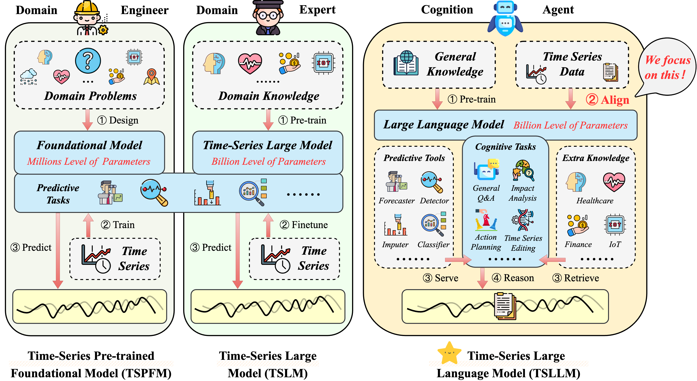

# Aligning Time Series Data with Large Language Models: A Survey

This repository is activately maintained by Wei Li from ***RUC WAMDM*** Group led by [*Dr. Xiaofeng Meng*](http://idke.ruc.edu.cn/). As this research topic has recently gained significant popularity, with new articles emerging daily, we will update our repository and survey regularly.

If you find some ignored papers, feel free to create pull requests, open issues, or *email* [*Wei Li*](mailto:leeway@ruc.edu.cn). Please consider [citing](#citation) our survey paper if you find it helpful :), and feel free to share this repository with others! 

### Updates:

[New🔥] (2025.2.11) Our survey paper is submitted to **IJCAI 2025, survey track**!

### Motivation and Contribution:

With the advancement of Large Language Models (LLMs), increased research has focused on aligning various fields with LLMs, providing unprecedented zero-shot and few-shot support, such as time-series field. **Our goal is to assist practitioners in exploring the novel paradigm for time series with LLMs that remains under-researched in data intelligence**.
<br/>

<div align="center">
    
</div>
<center>Figure 1. Comparison of Time-Series Pre-trained Foundational Model (TSPFM), Large Model (TSLM), and LLMs (TSLLM). TSLLM has more general knowledge and unified tasks than TSPFM and TSLM, and we focus on its alignment. The gray boxes denote external input.</center>
<br/><br/>

As shown in Figure 1, we have witnessed the potential for time series data with TSPFM, TSLM, and TSLLM, which are like domain engineers focusing on specific tasks such as iTransformer, experts with domain cognition such as Time-MOE, and robots with general cognition such as Time-LLM, respectively. Recent surveys provide a broad overview of various time-series tasks using LLMs, including forecasting, anomaly detection, classification, and other general tasks. Instead of focusing on specific tasks, we will discuss three attributes of time series: domains, dimensions, and modalities. Time series data collected from a variety of fields, including healthcare, finance, the Internet of Things (IoT), and general domains, which categorized into univariate and multivariate dimensions, using different modalities: Time Series (TS), text, and others.  The alignment targets are time series data and LLM, using alignment methods as a medium. The alignment methods include TS-Prompt-LLM, TS-Adapt-LLM, and TS-Finetune-LLM. For improved clarity, we provide a more intuitive representation as shown in Figure 2. In summary, the domain affects the design of the prompt, the dimension guides the design of the external adapter, and the modality determines the design of the internal encoder and decoder, respectively. The main contributions of this survey include:

1) We provide a comprehensive and up-to-date review of related works on aligning time series data with LLMs.
   
2) We categorize related works into three alignment methods: TS-Prompt-LLM, TS-Adapt-LLM, and TS-Finetune-LLM respectively.
   
3) We discuss the alignment methods and highlight future opportunities, encouraging researchers and practitioners to explore.

<br/>
<div align="center">
    
</div>
<center>Figure 2. Taxonomy of alignment methods. We categorize the related works into three methods organized by publication year: TS-Prompt-LLM (focus on trained text tokenizer), TS-Adapt-LLM (focus on trained external TS adapter), and TS-Finetune-LLM (focus on fine-tuned internal encoder and decoder), affected by domain, dimension, and modality respectively. For the related work that contains multiple alignment methods, we categorize based on the highest improvement of ablation experiments. The icons on the left side of the text box represent the domains, while those on the right side represent the modality or whether to train. The transparent icons represent optional items.</center>
<br/>

### Taxonomy of Semantic Alignment Methods:
We analyzed related works and found the bidirectional relationship and research trend between time series data and alignment methods, as shown in Figure 3. **You can download the project to get all the papers mentioned in our survey at once!**

<div align="center">
    
</div>
<center>Figure 3. A comprehensive taxonomy of method name follows each work listed from the perspectives of data alignment methods (e.g., TS-Prompt-LLM, TS-Finetune-LLM, TS-Adapt-LLM), data domains (e.g., general, healthcare, finance, IoT), data modalities (e.g., TS, text), and data dimensions (e.g., multivariate, univariate).</center>
<br/><br/>

**Bidirectional Relationships.** From the time series data to alignment methods, the domain affects the design of the prompt, the dimension guides the design of the external adapter, and the modality determines the design of the internal encoder and decoder, respectively. The prior knowledge of the domain is dynamic and specific and is suitable for input into LLM by prompts. The univariate and multivariate dimensions, including trend, fluctuation, and periodic correlations, and whether the external adapter is designed to be channel-independent depends on the correlation. The understanding of modalities, including time series, text, vision, and each other high-dimensional modality, requires the design of corresponding encoders, and the inference of modalities requires the design of corresponding decoders. From the alignment method to time series data, TS-Prompt-LLM focuses on specific domains, multivariate, and text modality. TS-Adapt-LLM focuses on channel-independent univariate design and time series modality. TS-Finetune-LLM focuses on general domains and multivariate correlation. 

**Research Trend.** The cost of the alignment method increases from the prompt stage to the internal encoder stage, and the closer to the internal optimization, the more overall improvements can be achieved. For the TS-Prompt-LLM, more prior knowledge allows for more effective communication with text data of the domain. As the initial stage of alignment, It has a lower alignment cost. For the TS-Adapt-LLM, an adapter is trained outside LLM as an external encoder layer. The time series is mapped to the corresponding word vector by the similarity matching of the adapter. For the TS-Finetune-LLM, the multivariate correlation within the general domain is optimized by designing the encoder or decoder and fine-tuning it.
<br/>


<!--
- [Taxonomy](#taxonomy)
  - [Prompting](#prompting)
  - [Quantization](#quantization)
  - [Aligning](#aligning)
  - [Vision](#vision)
  - [Tool](#tool)
- [Datasets](#datasets)
- [Citation](#citation)
-->

### TS-Prompt-LLM:

Date|Paper|Institute|Conference|Domain|LLM
---|---|---|---|---|---
14 Oct 2024|[SensorLLM: Aligning Large Language Models with Motion Sensors for Human Activity Recognition](https://arxiv.org/abs/2410.10624)|University of New South Wales, Sydney|Preprint|IoT|LLaMA
18 Oct 2024|[XForecast: Evaluating Natural Language Explanations for Time Series Forecasting](https://arxiv.org/abs/2410.14180)|Salesforce AI Research|Preprint|General|GPT-4
14 Aug 2024|[MedTsLLM: Leveraging LLMs for Multimodal Medical Time Series Analysis](https://arxiv.org/abs/2408.07773)|Department of Civil and Systems Engineering, Johns Hopkins University|MLHC'24|Health|LLaMA
25 Feb 2024|[LSTPrompt: Large Language Models as Zero-Shot Time Series Forecasters by Long-Short-Term Prompting](https://arxiv.org/abs/2402.16132)|Georgia Institute of Technology, Microsoft Research Asia|Preprint|General|GPT-3.5, GPT-4
26 Jan 2024|[Large Language Model Guided Knowledge Distillation for Time Series Anomaly Detection (AnomalyLLM)](https://arxiv.org/abs/2401.15123)|Zhejiang University|Preprint|General|GPT-2
6 Mar 2024|[K-Link: Knowledge-Link Graph from LLMs for Enhanced Representation Learning in Multivariate Time-Series Data](https://arxiv.org/abs/2403.03645)|Institute for Infocomm Research, Nanyang Technological University|Preprint|General|CLIP, GPT-2
11 Oct 2023|[Large Language Models Are Zero-Shot Time Series Forecasters (LLMTime)](https://arxiv.org/abs/2310.07820)|NYU, CMU|NeurIPS'23|General|GPT-3, LLaMA-2 
8 Oct 2023|[TEMPO: Prompt-based Generative Pre-trained Transformer for Time Series Forecasting](https://arxiv.org/abs/2310.04948)|University of Southern California, Google|ICLR'24|General|GPT-2
6 Sep 2023|[ETP: Learning Transferable ECG Representations via ECG-Text Pre-training](https://arxiv.org/abs/2309.07145)|Imperial College London, The Ohio State University|Preprint|Health|BioClinicalBERT
22 Jun 2023|[Instruct-FinGPT: Financial Sentiment Analysis by Instruction Tuning of General-Purpose Large Language Models](https://arxiv.org/abs/2306.12659)|Columbia University|FinLLM Symposium at IJCAI'23|Finance|LLaMA
24 May 2023|[Large Language Models are Few-Shot Health Learners](https://arxiv.org/abs/2305.15525)|Google|Preprint|Health|PaLM
10 Apr 2023|[The Wall Street Neophyte: A Zero-Shot Analysis of ChatGPT Over MultiModal Stock Movement Prediction Challenges](https://arxiv.org/abs/2304.05351)|Wuhan University, Southwest Jiaotong University, etc.|Preprint|Finance|ChatGPT
21 Jan 2023|[Transfer Knowledge from Natural Language to Electrocardiography: Can We Detect Cardiovascular Disease Through Language Models? (ECG-LLM)](https://arxiv.org/abs/2301.09017)|CMU, Allegheny General Hospital, etc.|EACL'23 Findings|Health|BERT, BART
1 Jan 2023|[Unleashing the Power of Shared Label Structures for Human Activity Recognition (SHARE)](https://arxiv.org/abs/2301.03462)|University of California|CIKM'23|IoT|GPT-4
20 Sep 2022|[PromptCast: A New Prompt-based Learning Paradigm for Time Series Forecasting](https://arxiv.org/abs/2210.08964)|University of New South Wales|TKDE'23|General|BART, BigBird, RoBERTa, etc.

### TS-Adapter-LLM:
Date|Paper|Institute|Conference|Domain|LLM
---|---|---|---|---|---
24 Nov 2024|[LeRet: Language-Empowered Retentive Network for Time Series Forecasting](https://www.ijcai.org/proceedings/2024/0460.pdf)|University of Science and Technology of China|Preprint|General|LLaMA
24 Oct 2024|[Hierarchical Multimodal LLMs with Semantic Space Alignment for Enhanced Time Series Classification (HiTime)](https://arxiv.org/abs/2410.18686)|State Key Laboratory of Cognitive Intelligence, University of Science and Technology of China|Preprint|General|GPT-2
21 Oct 2024|[LLM-TS Integrator: Integrating LLM for Enhanced Time Series Modeling](https://arxiv.org/pdf/2410.16489)|Borealis AI|Preprint|General|LLaMA
23 Sep 2024|[TS-HTFA: Advancing Time Series Forecasting via Hierarchical Text-Free Alignment with Large Language Models](https://arxiv.org/abs/2409.14978)|School of Computer Science and Technology, East China Normal University|Preprint|General|GPT-2
13 Aug 2024|[GenG: An LLM-Based Generic Time Series Data Generation Approach for Edge Intelligence via Cross-Domain Collaboration](https://ieeexplore.ieee.org/stamp/stamp.jsp?tp=&arnumber=10620716)|Future Network Research Center, Purple Mountain Laboratories|IEILM'24|IoT|LLaMA
19 Mar 2024|[Advancing Time Series Classification with Multimodal Language Modeling (InstructTime)](https://arxiv.org/abs/2403.12371)|University of Science and Technology of China|Preprint|General|GPT-2
19 Mar 2024|[Learning Transferable Time Series Classifier with Cross-Domain Pre-training from Language Model (CrossTimeNet)](https://arxiv.org/abs/2403.12372)|University of Science and Technology of China, Kuaishou Technology|Preprint|General|BERT, GPT-2
16 Feb 2024|[Time Series Forecasting with LLMs: Understanding and Enhancing Model Capabilities (TSFLLMs)](https://arxiv.org/abs/2402.10835)| Rutgers University, Shanghai Jiao Tong University, etc.|Preprint|General|GPT-3.5, GPT-4, LLaMA-2
10 Feb 2024|[REALM: RAG-Driven Enhancement of Multimodal Electronic Health Records Analysis via Large Language Models](https://arxiv.org/abs/2402.07016)|Beihang University, China Mobile Research Institute|Preprint|Health|BERT, BGE-M3, Qwen
4 Feb 2024|[AutoTimes: Autoregressive Time Series Forecasters via Large Language Models](https://arxiv.org/abs/2402.02370)|Tsinghua University|Preprint|General|LLaMA, GPT-2, OPT
24 Nov 2023|[Understanding the Role of Textual Prompts in LLM for Time Series Forecasting: an Adapter View (ExplicitAdapters4TS)](https://arxiv.org/abs/2311.14782)|Alibaba|Preprint|General|GPT-2
14 Nov 2023|[TENT: Connect Language Models with IoT Sensors for Zero-Shot Activity Recognition](https://arxiv.org/abs/2311.08245)|Nanyang Technological University|Preprint|IoT|CLIP, GPT-2
27 Oct 2023|[Insight Miner: A Time Series Analysis Dataset for Cross-Domain Alignment with Natural Language](https://openreview.net/forum?id=E1khscdUdH&referrer=%5Bthe%20profile%20of%20Ming%20Zheng%5D(%2Fprofile%3Fid%3D~Ming_Zheng2))|UC Berkeley, Mineral, etc.|NeurIPS'23 Workshop|General|LLaVA, GPT-4
27 Oct 2023|[JoLT: Jointly Learned Representations of Language and Time-Series](https://openreview.net/forum?id=UVF1AMBj9u&referrer=%5Bthe%20profile%20of%20Yifu%20Cai%5D(%2Fprofile%3Fid%3D~Yifu_Cai1))|CMU|NeurIPS'23 Workshop|Health|GPT-2, OPT
15 Oct 2023|[UniTime: A Language-Empowered Unified Model for Cross-Domain Time Series Forecasting](https://arxiv.org/abs/2310.09751)|National University of Singapore, The Hong Kong University of Science and Technology|WWW'24|General|GPT-2
9 Oct 2023|[Integrating Stock Features and Global Information via Large Language Models for Enhanced Stock Return Prediction (SCRL-LG)](https://arxiv.org/abs/2310.05627)|Hithink RoyalFlush Information Network Co., Ltd.|IJCAI'23|Finance|LLaMA
3 Oct 2023|[Time-LLM: Time Series Forecasting by Reprogramming Large Language Models](https://arxiv.org/abs/2310.01728)|Monash University, Ant Group, etc.|ICLR'24|General|LLaMA
25 Sep 2023|[DeWave: Discrete EEG Waves Encoding for Brain Dynamics to Text Translation](https://arxiv.org/abs/2309.14030)|Faculty of Engineering and Information Technology University of Technology Sydney|Preprint|Health|BART
16 Aug 2023|[TEST: Text Prototype Aligned Embedding to Activate LLM's Ability for Time Series](https://arxiv.org/pdf/2308.08241.pdf)|Peking University, Alibaba Group|ICLR'24|General|BERT, GPT-2, ChatGLM, etc.
22 Mar 2023|[Frozen Language Model Helps ECG Zero-Shot Learning (METS)](https://arxiv.org/pdf/2303.12311)|College of Electronic Science and Engineering, Jilin University|MIDL'23|Health|BERT
10 Aug 2022|[Can Brain Signals Reveal Inner Alignment with Human Languages? (MATM)](https://arxiv.org/abs/2208.06348)|Carnegie Mellon University|EMNLP'23|Health|BERT

### TS-Finetune-LLM:

Date|Paper|Institute|Conference|Domain|LLM
---|---|---|---|---|---
7 Jan 2025|[Context-Alignment: Activating and Enhancing LLM Capabilities in Time Series (DECA)](https://arxiv.org/pdf/2501.03747)|The Hong Kong Polytechnic University|Preprint|General|GPT-2
3 Jan 2025|[Time Series Language Model for Descriptive Caption Generation (TSLM)](https://arxiv.org/abs/2501.01832)|Nokia Bell Labs|Preprint|General|LLaMA-2
16 Dec 2024|[ChatTime: A Unified Multimodal Time Series Foundation Model Bridging Numerical and Textual Data](https://arxiv.org/abs/2412.11376)|Beijing University of Posts and Telecommunications|Preprint|General|LLaMA-2
4 Dec 2024|[ChatTS: Aligning Time Series with LLMs via Synthetic Data for Enhanced Understanding and Reasoning](https://arxiv.org/abs/2412.03104)|Tsinghua University|Preprint|General|QWen-2.5
27 Nov 2024|[LLM-ABBA: Understanding time series via symbolic approximation](https://arxiv.org/abs/2411.18506)|Department of Numerical Mathematics, Charles University|Preprint|General|Mistral-7B
30 Jul 2024|[A federated large language model for long-term time series forecasting (FedTime)](https://arxiv.org/abs/2407.20503)|Concordia Universit|Preprint|General|LLaMA
20 Jun 2024|[Understanding Different Design Choices in Training Large Time Series Models (LTSM-Bundle)](https://arxiv.org/abs/2406.14045)|Rice University|Preprint|General|GPT-2, Phi-2
7 Jun 2024|[DualTime: A Dual-Adapter Multimodal Language Model for Time Series Representation](https://arxiv.org/abs/2406.06620)|Hong Kong University of Science and Technology|Preprint|General|GPT-2, BERT
3 Jun 2024|[TimeCMA: Towards LLM-Empowered Multivariate Time Series Forecasting via Cross-Modality Alignment](https://arxiv.org/abs/2406.01638)|S-Lab, Nanyang Technological University|Preprint|General|GPT-2
24 Mar 2024|[GPT4MTS: Prompt-Based Large Language Model for Multimodal Time-Series Forecasting](https://ojs.aaai.org/index.php/AAAI/article/view/30383)|University of Southern California|AAAI'24|Finance|GPT-2, BERT
12 Mar 2024|[CALF: Aligning LLMs for Time Series Forecasting via Cross-modal Fine-Tuning](https://arxiv.org/abs/2403.07300)|Tsinghua University, Shenzhen University|Preprint|General|GPT-2
9 Mar 2024|[S^2IP-LLM: Semantic Space Informed Prompt Learning with LLM for Time Series Forecasting](https://arxiv.org/abs/2403.05798)|University of Connecticut, Morgan Stanley|Preprint|General|GPT-2
7 Feb 2024|[Multi-Patch Prediction: Adapting LLMs for Time Series Representation Learning (aLLM4TS)](https://arxiv.org/abs/2402.04852)|The Chinese University of Hong Kong, Tongji University, etc.|Preprint|General|GPT-2
16 Aug 2023|[LLM4TS: Aligning Pre-Trained LLMs as Data-Efficient Time-Series Forecasters](https://arxiv.org/abs/2308.08469)|National Yang Ming Chiao Tung University|Preprint|General|GPT-2
23 Feb 2023|[One Fits All:Power General Time Series Analysis by Pretrained LM (GPT4TS)](https://arxiv.org/abs/2302.11939)|Alibaba|NeurIPS'23|General|GPT-2

### Dataset

Dataset|Domain|Dimensions|Modality|Size
---|---|---|---|---
[ECG-QA](https://github.com/Jwoo5/ecg-qa)|Health|Multivariate|Text, ECG|70 question templates
[PTB-XL](https://physionet.org/content/ptb-xl/1.0.3/)|Health|Multivariate|Text, ECG|60h data, 71 unique statements
[Zuco 2.0](https://osf.io/2urht/)|Health|Multivariate|Text, EEG|739 sentences
[MIMIC-III](https://github.com/MIT-LCP/mimic-code)|Health|Multivariate|Text, TS|53,423 adult patients, 7,870 newborns
[CirCor](https://github.com/nttcslab/m2d/tree/master/app/circor)|Health|Multivariate|TS|1,568 patients, 5,282 records, 215,780 samples
[MoAT](https://openreview.net/pdf?id=uRXxnoqDHH)|Finance, Health|Multivariate|Text, TS|6 datasets, 2K timesteps in total
[PIXIU](https://github.com/chancefocus/PIXIU)|Finance|Multivariate|Text, TS|136K instruction data
[StockNet](https://github.com/yumoxu/stocknet-dataset)|Finance|Multivariate|Text, TS|8 stocks, 26,614 samples
[FNSPID](https://github.com/Zdong104/FNSPID_Financial_News_Dataset)|Finance|Multivariate|Text, TS|29.7M stock prices, 15.7M news records
[Ego4D](https://ego4d-data.org/)|IoT|Multivariate|Text, IMU|3,670h data, 3.85M narrations
[DeepSQA](https://github.com/nesl/DeepSQA)|IoT|Multivariate|Text, IMU|25h data, 91K questions
[Ego-Exo4D](https://ego-exo4d-data.org/)|IoT|Multivariate|Text, IMU|1,422h data
[M4](https://github.com/Mcompetitions/M4-methods)|General|Univariate|TS, Text|100,000 timestep data
[UEA](https://www.timeseriesclassification.com)|General|Multivariate|TS|30 datasets, 50,000 timestep
[UCR](https://www.cs.ucr.edu/∼eamonn/time_series_data)|General|Univariate|TS|128 datasets 

## Citation

If you find this useful, please cite our paper: "Aligning Time Series Data with Large Language Models: A Survey"
<!--
```
@article{zhang2024large,
  title={Large Language Models for Time Series: A Survey},
  author={Zhang, Xiyuan and Chowdhury, Ranak Roy and Gupta, Rajesh K and Shang, Jingbo},
  journal={arXiv preprint arXiv:2402.01801},
  year={2024}
}
```
-->
